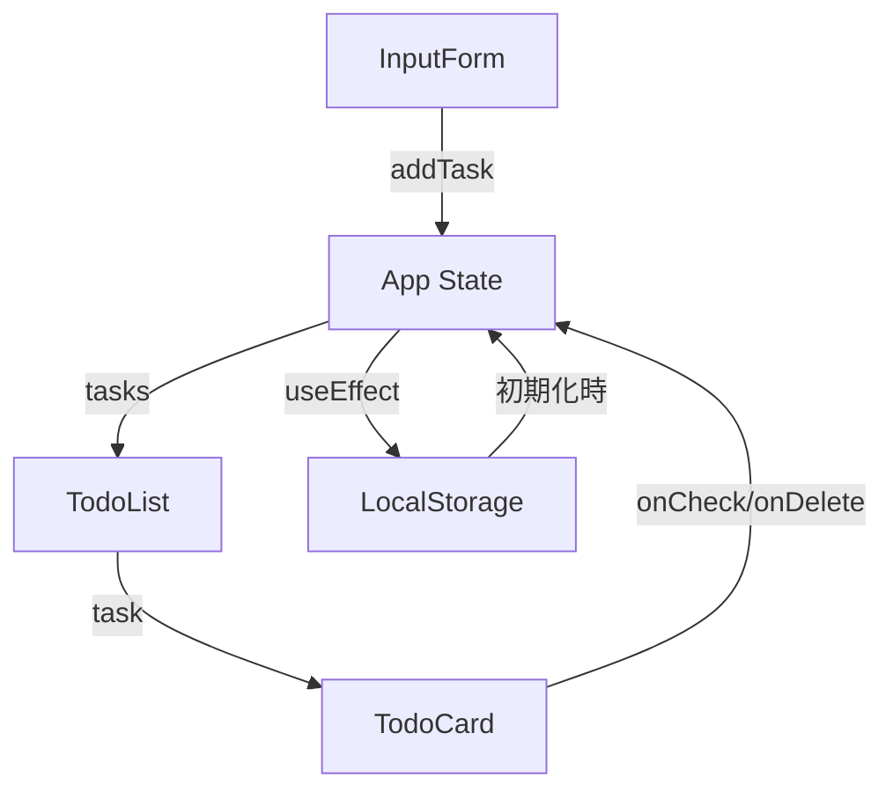

# Todoアプリ開発

React + TypeScript で作る
モダンなTodoアプリケーション

  
    始める <carbon:arrow-right class="inline"/>
  

---

## layout: default

# プロジェクト概要

## アプリケーション名

**Todoリストアプリ**

## 主な機能

- Todoタスクの追加・削除
- 期限設定と期限切れ表示
- タグによる分類
- 優先度設定（高・中・低）
- タグ・優先度での絞り込み
- LocalStorageでのデータ永続化

## デザイン

- カードベースのUI
- 3列グリッドレイアウト
- レスポンシブデザイン
- ホバーエフェクト

---

## layout: default

# 使用技術（1/2）

<v-clicks>

## React 19.1.0

- 最新のReact Hooks API
- 関数コンポーネントベース

## TypeScript 5.8.3

- 型安全性の確保
- 開発体験の向上

## Vite 7.0.4

- 高速な開発サーバー
- 最適化されたビルド

## CSS Modules

- コンポーネント単位のスタイリング
- スコープの分離

</v-clicks>

---

## layout: default

# 使用技術（2/2）

<v-clicks>

## ESLint

- コード品質の維持
- 一貫性のあるコーディング

## GitHub Pages

- 静的サイトホスティング
- 自動デプロイ対応

## LocalStorage API

- クライアントサイドでのデータ永続化
- サーバー不要のデータ保存

</v-clicks>

---

# こだわったポイント

<v-clicks>

## 🎨 UI/UXデザイン

- カードベースのモダンなデザイン
- 3列グリッドレイアウト
- レスポンシブ対応
- ホバー時のアニメーション

## 🔒 型安全性

- TypeScriptによる厳密な型定義
- 型推論の活用
- 実行時エラーの防止

## 🛡️ エラーハンドリング

- LocalStorageデータの検証
- 不正データの自動クリア
- 日付の妥当性チェック

## 🏗️ コンポーネント設計

- 責務の分離
- 再利用可能な設計
- Propsによるデータフロー

</v-clicks>

---

## layout: two-cols

# アーキテクチャ

## コンポーネント構成

<pre class="text-sm">
App.tsx
├── InputForm
│   └── Todo追加フォーム
├── TodoList
│   └── TodoCard (複数)
│       ├── チェックボックス
│       ├── タスク情報
│       └── 削除ボタン
└── FilterSection
    ├── タグフィルター
    └── 優先度フィルター
</pre>

::right::

## データフロー

---

## layout: default

# 実装のハイライト

## 🎯 型安全なデータ管理

- TypeScriptによる厳密な型定義
- Todo型、Tag型、Priority型の定義
- 型推論による開発効率向上

## ✅ データ検証

- LocalStorageから読み込んだデータの検証
- 不正なデータの自動クリア
- 型チェックによる安全性確保

## 📅 日付管理

- 期限の設定と表示
- 期限切れの自動判定
- 日付の妥当性チェック

## 📱 レスポンシブデザイン

- 3列→2列→1列の自動切替
- モバイル・タブレット・デスクトップ対応
- CSS Grid による柔軟なレイアウト

---

# デプロイ

## ⚙️ ビルド設定

- Viteでの最適化ビルド
- `docs`フォルダへの出力
- 相対パスでの設定

## 🚀 GitHub Pages

- 静的サイトとして公開
- 自動デプロイ対応
- 無料ホスティング

---

# まとめ

## 技術選定

- React 19
- TypeScript
- Vite

## 設計思想

- 型安全性
- コンポーネント分割
- エラーハンドリング

## UI/UX

- モダンなデザイン
- レスポンシブ対応
- 使いやすさ

  ありがとうございました!

